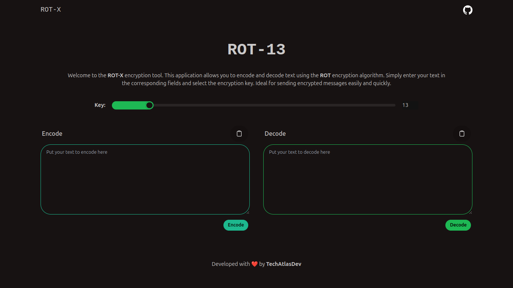

# ⛓️‍💥 ROT-X
ROT-X es un proyecto desarrollado con el objetivo de facilitar el uso del algoritmo ROT a través de tecnologías potentes. Este proyecto sirve como demostración de lo interesante que puede ser la criptografía y qué tan fácil se puede comprender el algoritmo ROT. Además, permite a los usuarios experimentar con la codificación y decodificación de mensajes de manera sencilla y divertida, brindando una forma accesible de introducirse en el mundo de la criptografía.

## 🧱 Enfoque del algoritmo
El algoritmo ROT (o ROT-n) es un tipo de cifrado por sustitución que desplaza cada letra del alfabeto un número fijo de posiciones. Por ejemplo, en ROT-13, cada letra se desplaza 13 lugares, lo que permite codificar y decodificar mensajes de manera rápida y eficiente. La importancia de este algoritmo radica en su simplicidad y facilidad de uso, lo que lo convierte en una excelente herramienta para aprender los fundamentos de la criptografía. A pesar de su simplicidad, ROT-n es un buen ejemplo de cómo funcionan los algoritmos más complejos en la criptografía moderna.

## 🧬 Tecnologías usadas
- Frontend:

1. React: Para construir una interfaz de usuario interactiva y dinámica.
2. Vite: Para un desarrollo rápido y eficiente, con recarga en caliente.
3. Tailwind CSS: Para estilos modernos y responsivos, facilitando el diseño de la interfaz.
4. DaisyUI: Para componentes UI accesibles y personalizables que agilizan el desarrollo.

- Backend:

1. Django: Un framework robusto para construir aplicaciones web, que facilita la creación de APIs.
2. Django REST Framework (DRF): Para construir APIs RESTful que se integran fácilmente con el frontend.

## ⚙️ Instalación
Para instalar y ejecutar el proyecto, sigue estos pasos:

1. Clona el repositorio:

```bash
git clone https://github.com/TechAtlasDev/rotx
cd rotx
```

2. Instalación del backend:

- Navega a la carpeta del backend:
```bash
cd backend
```

- Crea un entorno virtual (opcional pero recomendado):
```bash
python -m venv venv
source venv/bin/activate  # En Windows usa `venv\Scripts\activate`
```

- Instala las dependencias:
```bash
pip install -r requirements.txt
```

- Ejecuta las migraciones de la base de datos:
```bash
python manage.py migrate
```

- Inicia el servidor de desarrollo:
```bash
python manage.py runserver
```

2. Instalación del frontend:

- Navega a la carpeta del frontend:
```bash
cd ../frontend
```

- Instala las dependencias:
```bash
npm install  # O usa `pnpm install` si prefieres pnpm
```

- Inicia el servidor de desarrollo:
```bash
npm run dev
```

3. Accede a la aplicación:

Abre tu navegador y dirígete a http://localhost:5173 para ver la aplicación en acción.

## 📄 Contribuciones
Si deseas contribuir a este proyecto, por favor abre un Issue o envía un Pull Request. Todas las contribuciones son bienvenidas.